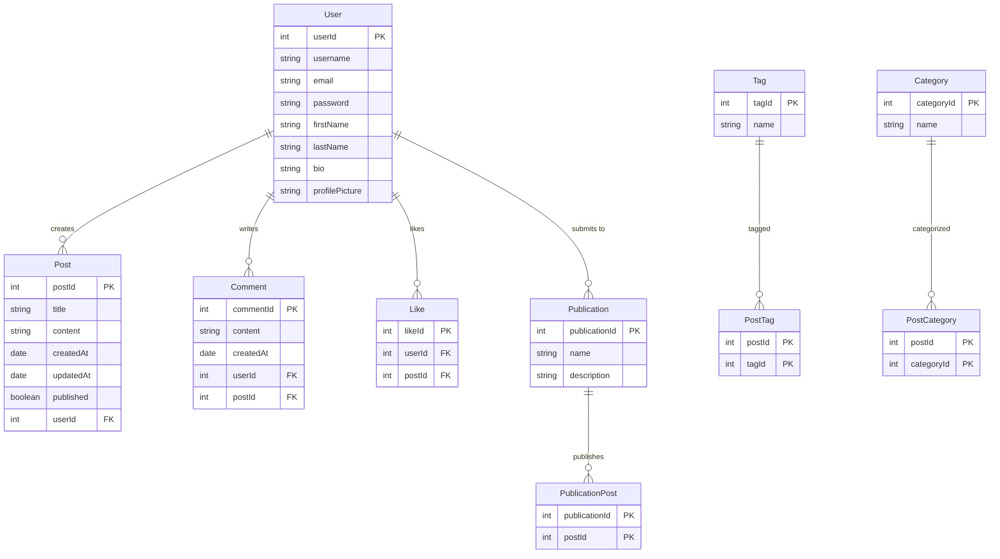
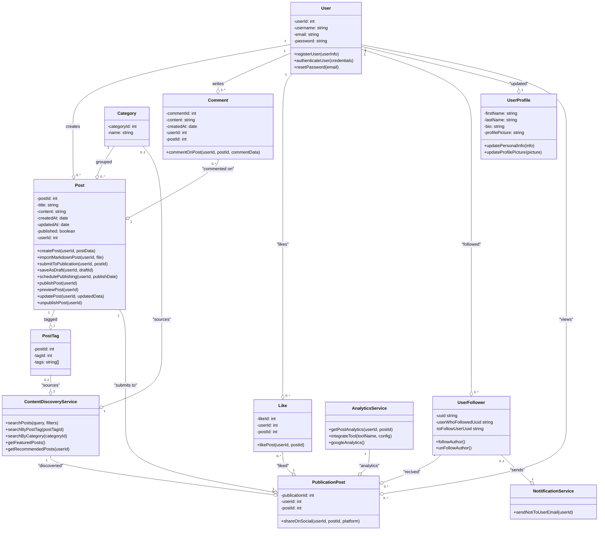

[[BlogDuaaeeg Overview]]

Based on [[Important note/Software Development Life Cycle (SDLC)/Implementation|Implementation]] we can developed the application following this roadmap. Which this can be describe as the following contents.

Source Project Can be found on [Github](https://github.com/textures1245/blog-duaaeeg-rest-api-service) 
## Contents

## **Tech-stacks**
- ### Frontend (Client)
	- TypeScript: Building for Client App
	- SvelteKit: Rendered Client App and also communicated API thought SvelteKit Server   
	- TailwindCSS
	- Svelte-Shadcn
- ### Backend (Server) 
	- Go: Building for App server.   
	- Gin: Web API Framework. Using **Clean Architectural By Robert C. Martin**
- ### Database
	- Prisma: Database Tool Designing
	- PostgresSQL
- ### DevOps
	- Docker
	- Nginx
	- Supabase 

## **System Design**
### Entity Relationship Diagram


### Class Diagram



## **Database**
Based on #BlogDuaaeeg-Class-Diagram  and #BlogDuaaeeg-ERD we can performed SQL Structure by using **Prisma** Database Tool Design that build on top with **[Prisma-Client-Go](https://github.com/steebchen/prisma-client-go)** 

```prisma 
// Note: 41f561d update: prisma schema v3

model User {
    id          Int           @default(autoincrement())
    uuid        String        @id @unique @default(uuid())
    createdAt   DateTime      @default(now())
    updatedAt   DateTime      @updatedAt
    email       String        @unique
    password    String
    posts       Post[]
    comments    Comment[]
    likes       Like[]
    userProfile UserProfile?
    UserContent UserContent[]
}

model UserProfile {
    id             Int      @default(autoincrement())
    uuid           String   @id @unique @default(uuid())
    firstName      String
    lastName       String
    bio            String
    profilePicture String
    user           User     @relation(fields: [userUuid], references: [uuid])
    userUuid       String   @unique
    createdAt      DateTime @default(now())
    updatedAt      DateTime @updatedAt
}

model Post {
    id          Int            @default(autoincrement())
    uuid        String         @id @unique @default(uuid())
    title       String
    content     String
    createdAt   DateTime       @default(now())
    updatedAt   DateTime       @updatedAt
    published   Boolean        @default(false)
    userUuid    String
    user        User           @relation(fields: [userUuid], references: [uuid])
    tags        PostTag[]
    categories  PostCategory[]
    comments    Comment[]
    likes       Like[]
    UserContent UserContent[]
}

model Tag {
    id        Int       @id @default(autoincrement())
    createdAt DateTime  @default(now())
    name      String    @unique
    posts     PostTag[]
}

model Category {
    id        Int            @id @default(autoincrement())
    createdAt DateTime       @default(now())
    name      String         @unique
    posts     PostCategory[]
}

model PostTag {
    postUuid  String
    tagId     Int
    createdAt DateTime @default(now())
    updatedAt DateTime @updatedAt
    post      Post     @relation(fields: [postUuid], references: [uuid])
    tag       Tag      @relation(fields: [tagId], references: [id])

    @@id([postUuid, tagId])
}

model PostCategory {
    postUuid   String
    categoryId Int
    createdAt  DateTime @default(now())
    updatedAt  DateTime @updatedAt
    post       Post     @relation(fields: [postUuid], references: [uuid])
    category   Category @relation(fields: [categoryId], references: [id])

    @@id([postUuid, categoryId])
}

model Comment {
    id        Int      @default(autoincrement())
    uuid      String   @id @unique @default(uuid())
    createdAt DateTime @default(now())
    updatedAt DateTime @updatedAt
    content   String
    userUuid  String
    postUuid  String
    user      User     @relation(fields: [userUuid], references: [uuid])
    post      Post     @relation(fields: [postUuid], references: [uuid])
}

model Like {
    id        Int      @default(autoincrement())
    uuid      String   @id @unique @default(uuid())
    createdAt DateTime @default(now())
    userUuid  String
    postUuid  String
    user      User     @relation(fields: [userUuid], references: [uuid])
    post      Post     @relation(fields: [postUuid], references: [uuid])
}

model UserContent {
    id              Int               @id @default(autoincrement())
    uuid            String            @unique @default(uuid())
    createdAt       DateTime          @default(now())
    updatedAt       DateTime          @updatedAt
    published       Boolean           @default(false)
    postUuid        String
    userUuid        String
    User            User              @relation(fields: [userUuid], references: [uuid])
    PublicationPost PublicationPost[]
    Post            Post              @relation(fields: [postUuid], references: [uuid])
}

model PublicationPost {
    id          Int         @default(autoincrement())
    uuid        String      @id @unique @default(uuid())
    createdAt   DateTime    @default(now())
    updatedAt   DateTime    @updatedAt
    contentUuid String
    postUUid    String
    publication UserContent @relation(fields: [contentUuid], references: [uuid])

```
## Route **Structure** 
- The benefit from using **Restful API** as App Architecture we can design our HTTPS request/response by the following **path structures** that we performed on  #BlogDuaaeeg-Usecases 
- All routes had prefix with `/api/v1`
### 1. Production Route
1. **User Registration** 🟢
	- Path: `POST /register`
	- Request Payload: `{ userInfo }`
	- Response: `registrationSuccessful`
2. **User Authentication** 🟢
	- Path: `POST /login`
	- Request Payload: `{ credentials }`
	- Response: `authenticationSuccessful`
3. **Update User Personal Information**` 🟢
	- Path: `PUT /users/{userId}/profile`
	- Request Payload: `{ info }`
	- Response: `infoUpdated`
5. **Create Post** 🟢
	- Path: `POST /posts`
	- Request Payload: `{ userId, postData }`
	- Response: `postCreated`
6. **Delete Post and PublisherPost** 🟢
	- Path: `DELETE /post/:user_uuid/post_form/post_uuid?action=DELETE`
	- Request Params Payload: `{action: "DELETE"}`
	- Response: `null`
1. **Publish Post** 🟢
	- Path: `PUT /posts/{postId}/publish`
	- Request Payload: `{ userId }`
	- Response: `postPublished`
2. **Submit Post to Publication** 🟢
	- Path: `POST /publications/{publicationId}/posts`
	- Request Payload: `{ userId, postId }`
	- Response: `postSubmitted`
3. **Like, UnLike Post** 🟢
	- Path: `POST /posts/{postId}/likes`
	- Request Payload: `{ userId }`
	- Response: `postLiked`
4. **Comment, Update, Delete on Post** 🟢
	- Path: `POST /posts/{postId}/comments`
	- Request Payload: `{ userId, commentData }`
	- Response: `commentAdded`
5. **Follow, UnFollow Author** 🟢
	- Path: `POST /users/{authorId}/followers`
	- Request Payload: `{ userId }`
	- Response: `authorFollowed`
1. **Search Posts**
	- Path: `GET /posts?query={query}&filters={filters}`
	- Request Payload: `{ query, filters }`
	- Response: `searchResults`
2. **Get Featured Posts**
	- Path: `GET /posts/featured`
	- Request Payload: None
	- Response: `featuredPosts`
3. **Get Recommended Posts for User**
	- Path: `GET /users/{userId}/recommended-posts`
	- Request Payload: None
	- Response: `recommendedPosts`
4. **Search Posts by Tag**
	- Path: `GET /posts/tags/{tagId}`
	- Request Payload: None
	- Response: `searchResults`
5. **Search Posts by Category**
	- Path: `GET /posts/categories/{categoryId}`
	- Request Payload: None
	- Response: `searchResults`
6. **Get Post Analytics**
	- Path: `GET /posts/{postId}/analytics`
	- Request Payload: `{ userId }`
	- Response: `postAnalytics`
7. **Integrate Analytics Tool**
	- Path: `POST /analytics/tools`
	- Request Payload: `{ toolName, config }`
	- Response: `toolIntegrated`
8. **Get Google Analytics Data**
	- Path: `GET /analytics/google`
	- Request Payload: None
	- Response: `googleAnalyticsData`
### 2. Testing Route
- Route using for functionality testing
1. **Authorization Barer **
	- Path: `GET /auth-test`
	- Request Payload: None
	- Response: `UserClaims`

